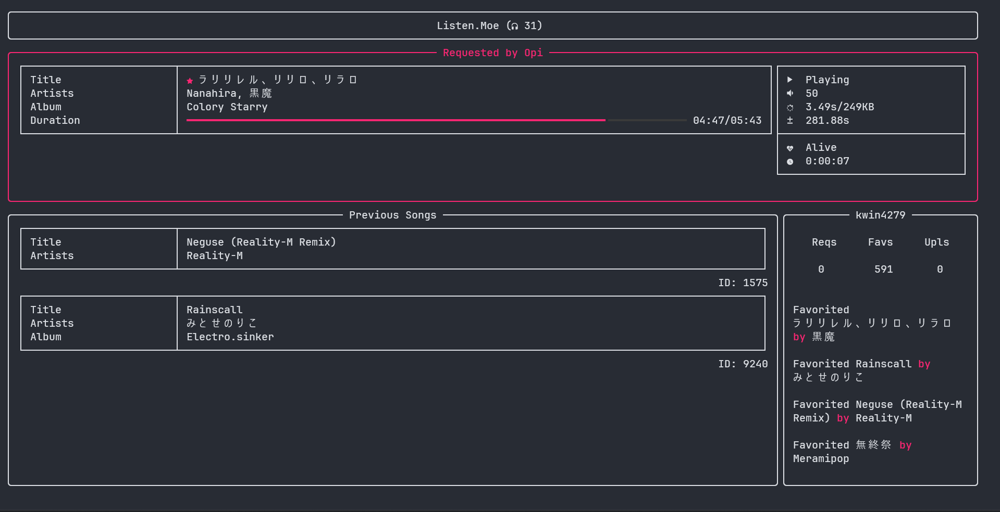
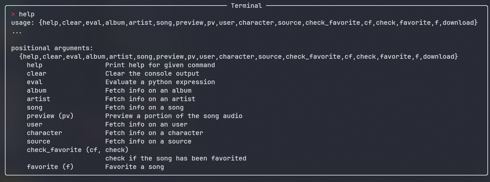

# <div align="center">ListenTUI</div>

<div align="center">A listen.moe TUI application</div>



---

# Glossary

- [New! This Update](#new-features)
- [Installation](#installation)
- [Usage Options](#usage-options)
- [Configuration](#configuration)
  - [System](#system)
  - [Keybind](#keybind)
  - [Display](#display)
  - [Rich Presence](#rich-presence)
  - [Player](#player)
- [Terminal](#terminal)
- [Additional Features](#additional-features)
- [Building](#build)

---

# New Features

```diff
[Features]
+ Rich Presence customisation
+ Integrated Terminal, more at #terminal
+ Now show ongoing event
+ Song requester now gets more flair
+ Add some optional startup argument, more at #usage-options


[System Changes]
+ Token validation
+ Raised user feed limit to 10 (from 5)
+ User feed will now only display the first artist per song
- Remove `seek_to_end` as a keybind, use `restart_player` instead
```

# Installation

## Requirements

- `libmpv`

The program uses mpv to playback audio and as such requires `libmpv` to be installed on your system.

For Windows user, regular mpv player binaries do not contain `libmpv`, refer to this [issue](https://github.com/jaseg/python-mpv/issues/60#issuecomment-352719773) to resolve the problem.

- `A nerd font`

For the icons, a nerd font font pack is required, get them at [Nerd Font](https://www.nerdfonts.com/), remember to set your terminal font aswell.

## How to run

#### Linux

Hold on, linux needs some time, idk why but a build is 230mb in size
<!-- 1. Download the latest binary from releases
2. Move file to $PATH
3. Run `listentui` -->

#### Windows

1. Download the latest executable from releases
2. Move file to %PATH%
3. Run `listentui` in any terminal

Alternatively, double clicking the executable works too (although it will run it under cmd.exe)

#### Universal

1. Download the `listentui*.whl` file
2. In a terminal, run `pip install` on the whl file
3. Run `listentui`

# Usage Options

```sh
listentui [OPTIONS]
```

## General Options

```txt
-h, --help        Print this help text and exit
-c, --config      Path to config file
-l, --log         Enable logging to file
--bypass          Bypass and clears the instance lock
```

# Configuration

Configuration is done through `config.toml`

Base on your distro, this is located at:

- Linux: `$XDG_CONFIG_HOME/listentui/config.toml` or `$HOME/.config/listentui/config.toml`
- Windows: `%APPDATA%\listentui\config.toml`

#### System

- `username`: username used to log into listen.moe
- `password`: password used to log into listen.moe
- `instance_lock`: limit the running instance to one

#### Keybind

Tip: You can use identifiers such as `${SPACE}`, more at [Window](https://github.com/magmax/python-readchar/blob/master/readchar/_win_key.py), [Linux](https://github.com/magmax/python-readchar/blob/master/readchar/_posix_key.py)

- `play_pause`: toggle play/pause
- `lower_volume`: lower the volume of the player
- `raise_volume`: raise the volume of the player
- `lower_volume_fine`: lower the volume by 1
- `raise_volume_fine`: raise the volume by 1
- `favourite_song`: favourite the current playing song (only when logged in)
- `restart_player`: restart the player
- `open_terminal`: open the integrated terminal

#### Display

- `romaji_first`: use romaji (if any) before original
- `separator`: separator between artists

#### Rich Presence

- `enable_rpc`: enable rich presence integration
- `default_placeholder`: placeholder for when text field falls below the two character limit specified by discord
- `use_fallback`: use a fallback image if there isnt one
- `fallback`: the fallback image, has to be a link that discord can access (alternatively, use "fallback2" for [listen.moe](https://listen.moe/_nuxt/img/logo-square-64.248c1f3.png) icon)
- `use_artist`: use the artist image instead if no album image is found

#### Player

- `volume_step`: the volume used by `raise/lower_volume`
- `restart_timeout`: the timeout (secs) to restart the player when there is no playback
- `[player.mpv_options]`: additional options that can be passed into mpv (the default is recommended), see [mvp options](https://mpv.io/manual/master/#options) for more info

# Terminal



The terminal allows user to query different information through listen.moe

## Usage

```txt
{help,clear,eval,album,artist,song,preview,pv,user,character,source,check_favorite,cf,check,favorite,f,download}

help                        Print help for given command
clear                       Clear the console OUtPUt
eval                        Evaluate a python expression
album                       Fetch info on an album
artist                      Fetch info on an artist
song                        Fetch info on a song
preview (pv)                Preview a portion of the song audio
user                        Fetch info on an user
character                   Fetch info on a character
source                      Fetch info on a source
check_favorite (cf, check)  Check if the song has been favorited
favorite (f)                Favorite a song
download                    Download a song
```

If you're unsure, run `help {command}` for more information about the command

# Additional features

### `Dynamic Range Compression`

Mpv supports dynamic range compression (lower the sounds at higher volume and raise the sound at lower volume), if you want to use drc, add this to `mpv_options` in config.

```toml
af = "acompressor=ratio=4,loudnorm=I=-16:LRA=11:TP=-1.5" 
```

# Build

Requires:

- `python3.11.1^`
- `poetry`

```sh
poetry shell
poetry install
poetry build
poetry run python build.py
```

build files are located in `dist`
